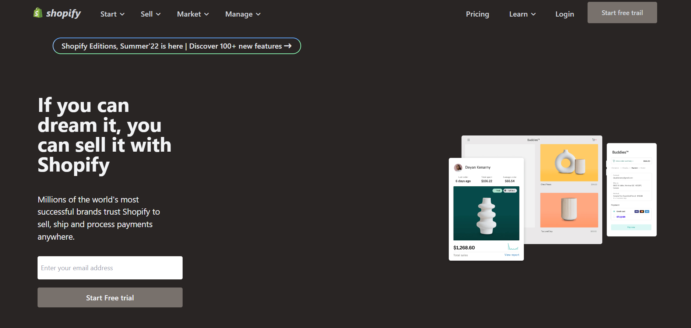
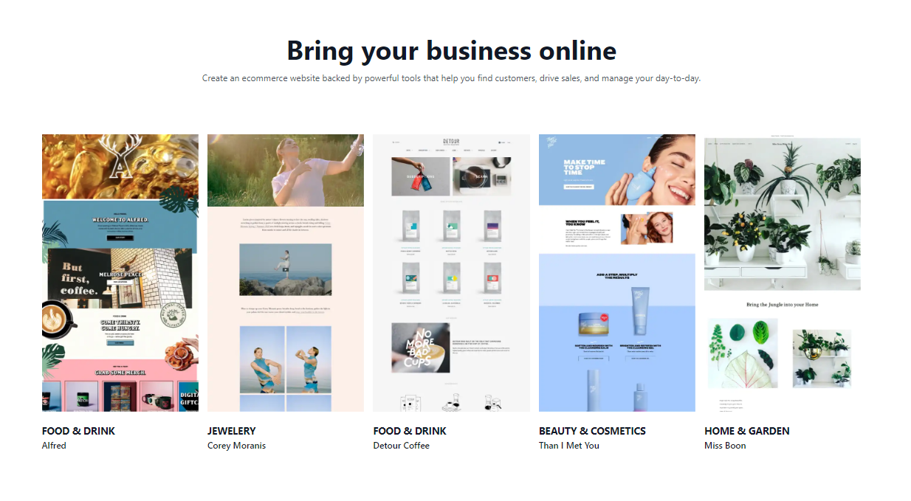
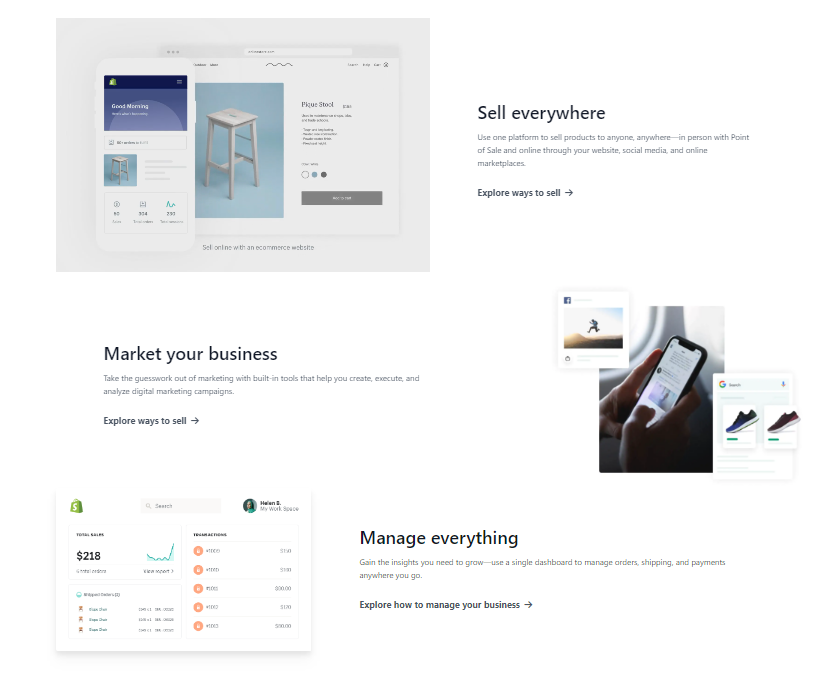
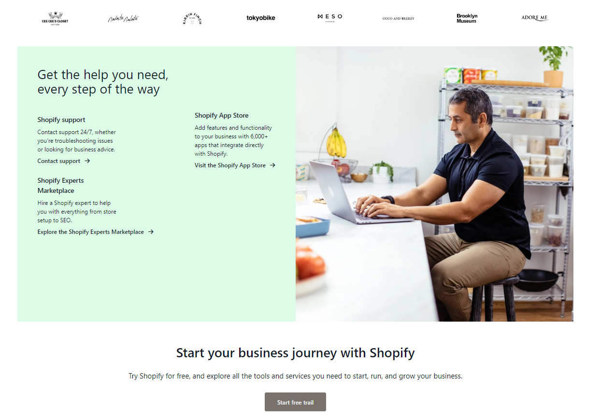

# Shopify Clone
 

 

***

## Skills learnt :
- Designing using  **Tailwindcss** by reading through the docs with minimal or no usage of **Css**. 
- Designing **Header**, **Hero**, **Cards**, **Blogs**, **Call to action** and much more.
- Got more knowledge on making **Responsive design**.
***

## Time taken :
- 15+ hours to complete this project. (Worth the time spent, Great learning!!!)
***
## Project  [Link](https://shopifi1-clone.netlify.app/)
***
## Project screenshots(few) :

